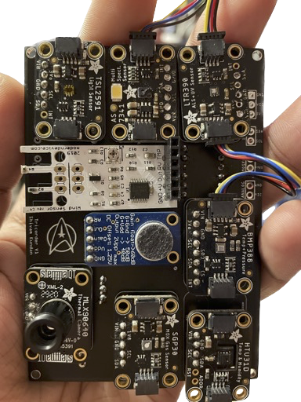

.. Tricorder-Rpi documentation master file, created by
   sphinx-quickstart on Wed Jun  7 01:06:41 2023.
   You can adapt this file completely to your liking, but it should at least
   contain the root `toctree` directive.

Welcome to Tricorder-Rpi's documentation!
=========================================

About this project
-------------------

Implementation of a **functional** tricorder device from Star Trek. This manual documents one portion of a two-part project running on a battery powered RaspberryPi 4.

Find the code at github: `here`_.

.. _here: https://github.com/shivamkundan/Tricorder-RaspberryPi

.. note::
   This is still a work in progress.

Goals
~~~~~~
* Create the most advanced possible tricorder
* Learn about hardware
* Learn about software
* Become the ultimate *Star Trek* fan

.. toctree::
   :maxdepth: 3
   :hidden:
   :caption: Contents

   modules

.. toctree::
   :maxdepth: 1
   :hidden:
   :caption: About

   About/about_hw
   About/about_sw

Indices and tables
==================

* :ref:`genindex`
* :ref:`modindex`
* :ref:`search`
